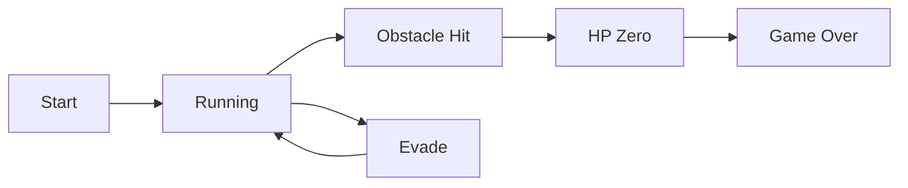
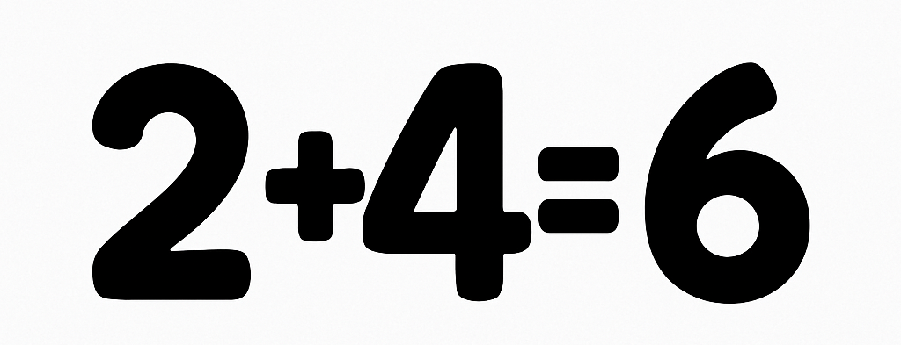

#  2+4=6명이조 - 쿠키런 스타일 러닝 게임 (Unity)

Unity 2022.3.17f1 엔진으로 제작한 횡스크롤 러닝 게임입니다.  
플레이어는 장애물을 회피하고, 아이템을 획득하며 점수를 쌓고, 체력을 관리하며 최대한 멀리 달리는 것이 목표입니다.

---

## 🎮 게임 주요 루프



---

## 📌 핵심 기능 구성

### 1. 캐릭터
- 시간에 따른 HP 점진 감소
- 기본 조작: 점프, 슬라이딩
- 체력 0% 도달 시 게임 종료

### 2. 아이템
- 점수 획득 아이템
- 이동 속도 상승 / 하락 아이템
- 체력 회복 아이템

### 3. 장애물
- 유형: 충돌 시 체력 감소
- 무형: 통과 가능 (회피 필수)
- 시간 기반 자동 생성

### 4. 게임 진행 관리
- 시간 경과에 따라 난이도 증가
  - 장애물 밀도 증가
  - 캐릭터 이동 속도 증가
- 시간에 따른 점수 / 체력 변화

### 5. UI 시스템
- 체력 게이지 바
- 현재 점수 / 최고 점수 표시
- 게임 종료 시 결과 요약 UI 표시

### 6. 게임 오버 및 재시작
- 체력 소진 시 게임 종료
- 게임 오버 화면에서 재시작 또는 메인으로 복귀 가능

---

## 👥 팀 정보

- **팀명:** 2+4=6명이조
- **팀장:** 
   -박헌익  
- **팀원:**  
  - 권윤원  
  - 김민범  
  - 오태영  
  - 전창민  
  - 정지민

---

## 🛠️ 개발 환경

- **엔진:** Unity 2022.3.17f1  
- **언어:** C#  
- **사용 툴:** TextMeshPro, Animator 등

---

## 🖼️ 팀 로고


```
2+4=6명이조
```


---


